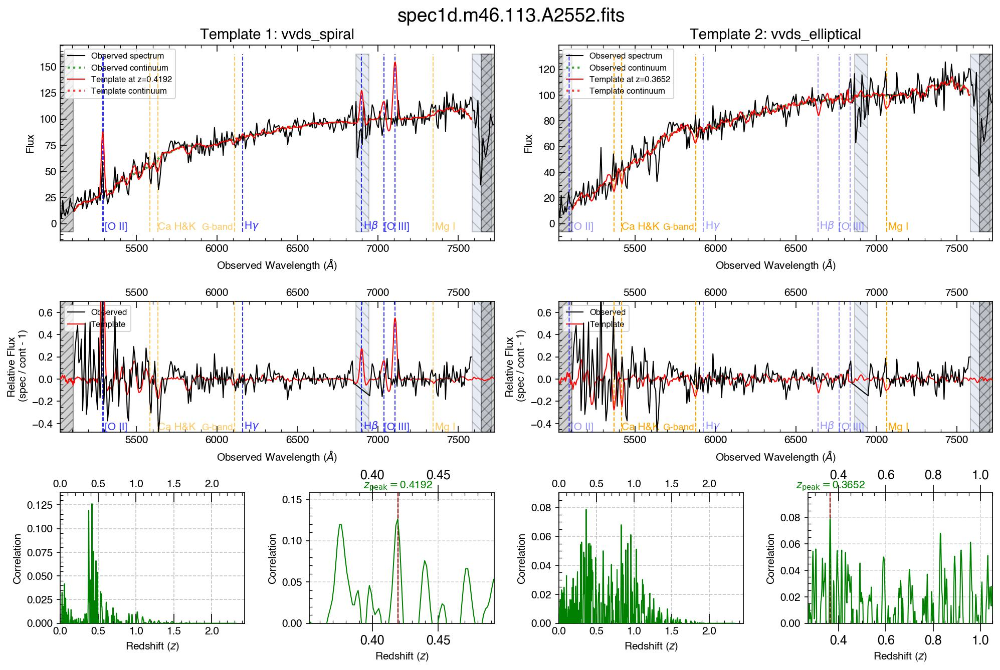

.. image:: img/logo.png
   :width: 60

**Fast Initial REdshift Fitting of cLuster galaxY (FIREFLY)**
####################################################################################

To run, use your bash terminal and type:

.. code-block:: 

    $ python firefly.py input_spec1d/ input_spec2d/ output_JPGs/ -all sdss_luminous_red sdss_late_type

Here, ``input_spec1d/`` is the folder that you want FIREFLY to fit for redshifts, ``-all`` means you'd like to fit all files in your specified folder, ``vvds_spiral`` is the template that FIREFLY will use during the fitting.

To redo fitting for one spectrum, e.g., ``spec1d.m46.030.A2552.fits``, (and with your desired redshift, for example, z=0.68 and 0.67), use 

.. code-block:: 

    $ python firefly.py input_spec1d/ input_spec2d/ output_JPGs/ spec1d.m46.030.A2552.fits sdss_luminous_red sdss_late_type 0.68 0.67

See a jupyter-notebook-like tutorial at `Google Colab <https://colab.research.google.com/drive/1s5pAIuA5Ou4Olkoos1lXTkWuoDD_Zf_d?usp=sharing>`_ (Updates may be slower than GitHub repository).
